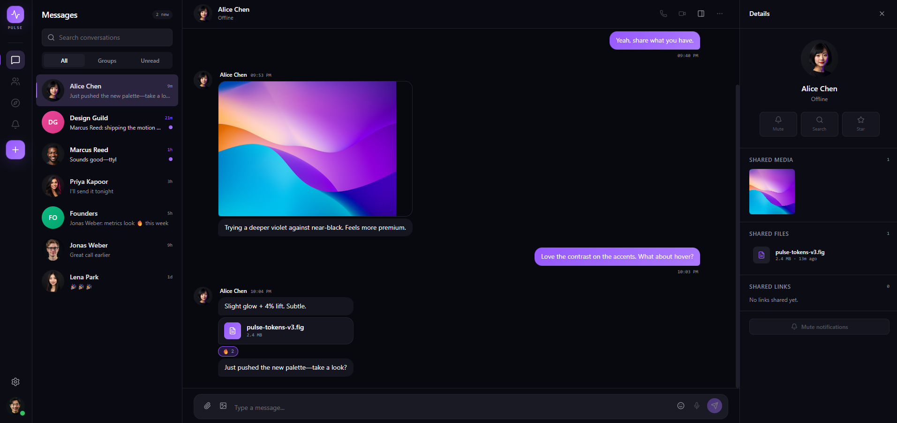

# Pulse

Real-time chat app with private and group conversations, built with ASP.NET Core, SignalR, MediatR, React, TypeScript, and PostgreSQL.



[](https://github.com/tonymocanu97/pulse/actions/workflows/backend-ci.yml)
[](https://github.com/tonymocanu97/pulse/actions/workflows/frontend-ci.yml)

## Tech Stack

**Backend:** ASP.NET Core · SignalR · MediatR (CQRS) · EF Core · PostgreSQL · JWT Auth · BCrypt
**Frontend:** React · TypeScript · Vite · Tailwind CSS
**Testing:** xUnit · Moq · FluentAssertions · Testcontainers
**DevOps:** Docker · GitHub Actions

## Features

- JWT authentication with BCrypt password hashing
- Online/offline presence, broadcast live over SignalR
- Private (1-1) and group conversations
- Real-time messaging via SignalR, dispatched through MediatR commands
- Paginated message history
- Typing indicators and read receipts
- Emoji reactions on messages
- Image/file uploads on messages

## Architecture

```
Pulse/
├── src/
│   ├── Pulse.API              # Controllers, SignalR Hub, Program.cs
│   ├── Pulse.Application      # MediatR Commands/Queries, DTOs, interfaces
│   ├── Pulse.Domain           # Entities, enums
│   ├── Pulse.Infrastructure   # EF Core, repositories, JWT/BCrypt
│   └── Pulse.Web              # React + TypeScript frontend
├── tests/
│   ├── Pulse.UnitTests
│   └── Pulse.IntegrationTests
├── .github/workflows/
├── Dockerfile
├── docker-compose.yml
├── README.md
└── Pulse.slnx
```

### MediatR flow (send message)

```
POST /api/messages
→ Controller receives the request
→ Dispatches SendMessageCommand via MediatR
→ Handler validates, saves to DB
→ IChatNotificationService pushes the message to the conversation's
  SignalR group, so every connected participant gets it live
```

### Domain entities

```
User            Id, Username, Email, PasswordHash, AvatarUrl, IsOnline, LastSeen
Conversation    Id, Name, IsGroup, CreatedAt
Participant     ConversationId, UserId, JoinedAt, LastReadAt
Message         Id, ConversationId, SenderId, Content, Type, SentAt, IsEdited, Reactions[]
MessageReaction Id, MessageId, UserId, Emoji, CreatedAt
```

Read receipts use a watermark (`Participant.LastReadAt`) rather than a per-message row: a
message is "read" by a participant once its `SentAt` is at or before their `LastReadAt`.

### SignalR hub (`/hubs/chat`)

```csharp
// Server → client
ReceiveMessage(message)
UserTyping(conversationId, username)
UserOnline(userId, lastSeen)
UserOffline(userId, lastSeen)
MessageRead(messageId, userId)

// Client → server
JoinConversation(conversationId)
LeaveConversation(conversationId)
SendTypingIndicator(conversationId)
```

Online/offline presence is tracked automatically on hub connect/disconnect.

## Getting Started

### Backend

Requires a local PostgreSQL instance - `docker-compose up -d` starts one on `localhost:5432`
matching the connection string in `appsettings.Development.json`.

```bash
dotnet restore
dotnet ef database update --project src/Pulse.Infrastructure --startup-project src/Pulse.API
dotnet run --project src/Pulse.API
```

API runs on https://localhost:7055 (http://localhost:5035), with Swagger UI at `/swagger`.

### Frontend

```bash
cd src/Pulse.Web
npm install
npm run dev
```

Runs on `http://localhost:5173`. Defaults to `http://localhost:5035/api` if `VITE_API_URL`
isn't set (copy `.env.local.example` to `.env.local` to override).

## Testing

```bash
# Unit tests only
dotnet test tests/Pulse.UnitTests

# Integration tests (spins up a real Postgres container - Docker must be running)
dotnet test tests/Pulse.IntegrationTests
```
